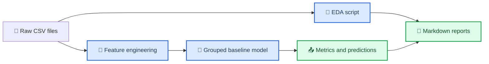

# SINOPEC-02 井眼轨迹关键点识别

_面向中石化定向钻井关键点识别任务的可复现数据分析与 baseline 项目。_

---

## 项目概览

本项目围绕 `SINOPEC-02` 数据集，完成以下工作：

- 拆分并理解实际轨迹点与设计轨迹点
- 形成面向定向钻井关键点识别的任务定义
- 构建按井分组的特征工程与交叉验证基线
- 生成分析文档、图表与本地 memory



## 目录结构

- `SINOPEC-02/`: 原始数据集
- `src/sinopec02/`: 数据处理、特征工程、建模代码
- `scripts/`: 可直接运行的分析与训练脚本
- `docs/analysis/`: 任务分析与 EDA 报告
- `reports/`: 运行脚本后生成的图表、指标与预测文件
- `memory/`: 本项目的本地工作记忆

## 数据说明

核心文件：

- `SINOPEC-02/train.csv`
- `SINOPEC-02/validation_without_label.csv`
- `SINOPEC-02/sample_submission.csv`

已确认的数据规律：

- `train.csv` 同时包含实际轨迹点和设计轨迹点
- 实际轨迹点带有 `关键点` 标签；设计轨迹点无标签
- 验证集的 `sample_submission.csv` 只要求对实际轨迹点提交
- 训练井与验证井不重叠，必须按井分组评估

## 快速开始

### 环境

- Python `>=3.10`
- 依赖：`pandas`、`numpy`、`scikit-learn`、`matplotlib`

### 运行 EDA

```bash
python scripts/eda_report.py
```

生成：

- `docs/analysis/data_report.md`
- `reports/figures/*.png`
- `reports/data_summary.json`

### 运行 baseline

```bash
python scripts/train_baseline.py
```

生成：

- `reports/cv_metrics.json`
- `reports/oof_predictions.csv`
- `reports/structured_predictions.csv`

## 当前 baseline 思路

### 任务定义

将每口井看作一条按 `XJS` 排序的轨迹序列，对每个实际测点做 4 分类：

- `0`: 非关键点
- `1`: 增斜点
- `2`: 稳斜点
- `3`: 降斜点

### 特征

- 原始轨迹：`XJS`、`JX`、`FW`、`LJCZJS`
- 方位角圆周编码：`sin(FW)`、`cos(FW)`
- 一阶/二阶差分与局部变化率
- 滚动窗口统计量
- 实际轨迹与设计轨迹对齐后的偏差特征

### 评估

- 使用 `GroupKFold`，按井号分组
- 报告 point-wise 指标
- 增加每井结构化后处理，强制标签顺序满足 `1 -> 2 -> 3`
- 新增多模型比较与概率融合搜索

## 当前结果

基于 `RandomForest + 特征工程 + 每井结构化解码` 的 5 折按井交叉验证结果：

- Raw macro-F1: `0.5932`
- Structured macro-F1: `0.6322`
- Raw weighted-F1: `0.9803`
- Structured weighted-F1: `0.9823`

分类层面：

- `1` 类 F1 从 `0.6531` 提升到 `0.7813`
- `2` 类 F1 从 `0.5303` 提升到 `0.5984`
- `3` 类仍然最难，结构化后召回升高但精度较低

说明：

- 结构化后处理是有效的
- 设计轨迹对齐与局部变化率特征有价值
- 下一阶段值得尝试两阶段候选点检测或序列模型

## 扩展结果

在 `RandomForest / ExtraTrees / CatBoost` 的 OOF 概率上做简单加权融合后，得到更强结果：

- Best ensemble weights: `RF 0.6 + ET 0.2 + CatBoost 0.2`
- Structured macro-F1: `0.6414`

对应脚本：

- `python scripts/compare_models.py`
- `python scripts/search_ensemble.py`
- `python scripts/train_ensemble.py`

## 序列模型试验

已补充纯 PyTorch `BiLSTM` 序列标注 baseline：

- 脚本：`python scripts/train_sequence_baseline.py`
- 结果：raw macro-F1 `0.4292`
- 结果：structured macro-F1 `0.5669`

结论：

- 该轻量序列模型目前明显弱于表格特征 + 结构化解码方案
- 当前更值得继续投入的方向不是直接堆深度模型，而是做两阶段候选点检测或更强结构化建模

## 候选点分析

基于当前最佳 ensemble 的 OOF 概率，已做两阶段路线的可行性检查：

- `1` 类 top-2 候选覆盖率：`95.3%`
- `2` 类 top-5 候选覆盖率：`92.1%`
- `3` 类 top-10 候选覆盖率：`92.0%`

这说明下一步最合理的研究路线是：

- 先生成小规模候选点集合
- 再对候选点做排序或精分类

## 重要结论

- 这个问题本质上是序列关键点识别，不是普通 IID 表格分类
- 类别极不平衡，关键点非常稀少
- 设计轨迹是重要辅助信息，但需要插值对齐
- 直接随机划分样本会造成严重数据泄漏

## 参考文档

- `docs/analysis/task_analysis.md`
- `docs/analysis/data_report.md`
- `docs/analysis/model_plan.md`
- `docs/analysis/baseline_results.md`
- `docs/analysis/model_comparison.md`
- `docs/analysis/sequence_results.md`
- `docs/analysis/candidate_analysis.md`
- `memory/session_memory.md`
