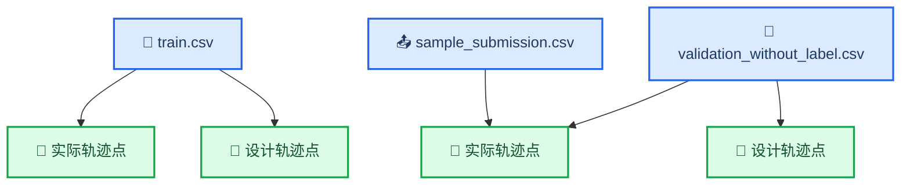
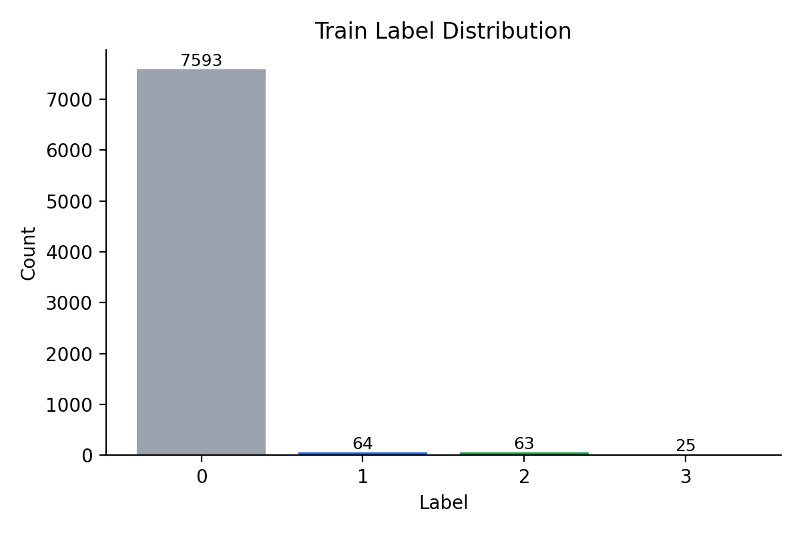
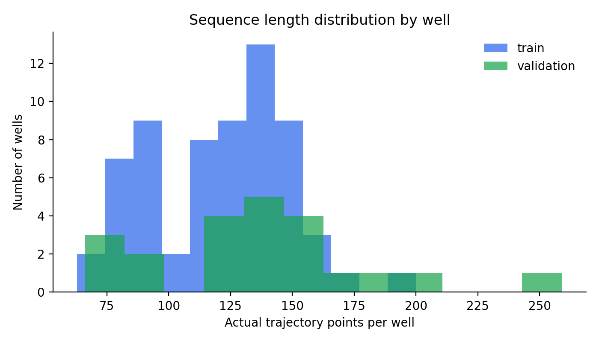

# SINOPEC-02 数据探索报告

_自动生成于 2026-03-16T16:45:00，用于任务理解、建模约束确认与 baseline 设计。_

---

## 数据结构

- 训练集总行数：`8603`
- 验证集总行数：`3217`
- 提交文件行数：`3046`
- 训练集实际轨迹点：`7745`
- 训练集设计轨迹点：`854`
- 验证集实际轨迹点：`3046`
- 验证集设计轨迹点：`171`

## 核心发现

- 训练井数量：`64`
- 验证井数量：`22`
- 训练井与验证井重合数：`0`
- 结论：验证集为未见井，评估必须按井分组进行

- 标签分布：
  - `0`: `7593`
  - `1`: `64`
  - `2`: `63`
  - `3`: `25`

## 建模含义

- 该任务应视为按井分组的序列关键点识别问题
- 标签高度不平衡，不能只看整体准确率
- 设计轨迹与实际轨迹分开存储，使用前必须按 `XJS` 对齐
- `FW` 是圆周变量，需要采用角度差而非普通减法
- 同一口井内关键点满足顺序约束：`1 -> 2 -> 3`

## 推荐下一步

1. 仅保留实际轨迹点作为预测对象
2. 用设计轨迹作为辅助特征来源
3. 做按井 `GroupKFold` 交叉验证
4. 在点级分类之后加入每井结构化后处理
