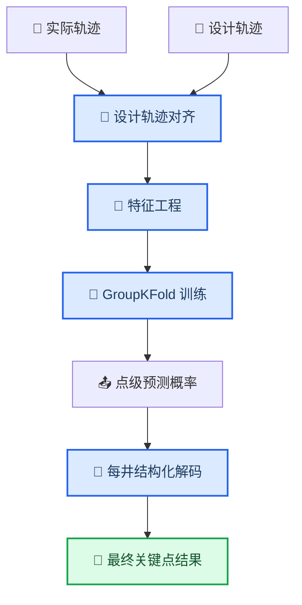

# SINOPEC-02 建模计划

_以可复现 baseline 为核心，逐步扩展到结构化与序列模型。_

---

## 基线方案

### 输入

- 实际轨迹点：`XJS`、`JX`、`FW`、`LJCZJS`
- 设计轨迹对齐结果：`JX_design_aligned`、`FW_design_aligned`、`LJCZJS_design_aligned`

### 特征

- 原始数值特征
- 一阶差分与变化率
- 二阶变化率
- 滚动窗口统计量
- 设计偏差特征
- 方位角 `sin/cos`
- 井内相对位置

### 模型

- `RandomForestClassifier`
- `class_weight="balanced_subsample"`
- `GroupKFold` 按井交叉验证

### 后处理

在每口井上，根据各标签概率做结构化解码：

- 至少选一个 `1`
- 至少选一个 `2`
- 可选一个 `3`
- 保证顺序 `1 <= 2 <= 3`

## 评估重点

- macro-F1
- 关键点类别 `1/2/3` 的精确率与召回率
- 结构化后处理前后对比
- 不同井型上的稳定性

## 后续扩展

- 更强的梯度提升模型
- 序列神经网络
- 两阶段候选点检测
- 融合录井过程数据

